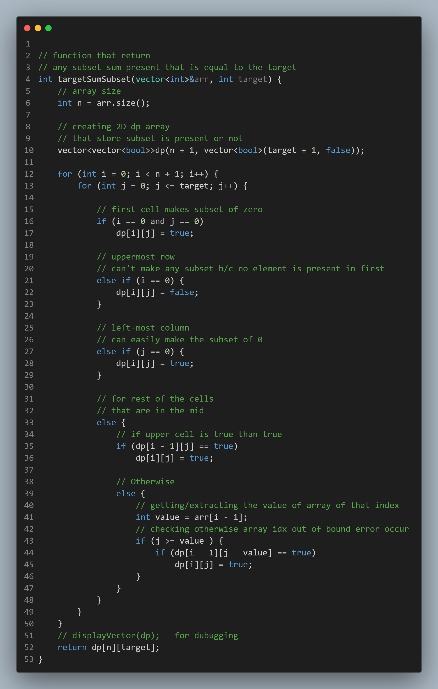

# Target Sum Subset:-
---
```c++
// function that return
// any subset sum present that is equal to the target
int targetSumSubset(vector<int>&arr, int target) {
	// array size
	int n = arr.size();

	// creating 2D dp array
	// that store subset is present or not
	vector<vector<bool>>dp(n + 1, vector<bool>(target + 1, false));

	for (int i = 0; i < n + 1; i++) {
		for (int j = 0; j <= target; j++) {

			// first cell makes subset of zero
			if (i == 0 and j == 0)
				dp[i][j] = true;

			// uppermost row
			// can't make any subset b/c no element is present in first
			else if (i == 0) {
				dp[i][j] = false;
			}

			// left-most column
			// can easily make the subset of 0
			else if (j == 0) {
				dp[i][j] = true;
			}

			// for rest of the cells
			// that are in the mid
			else {
				// if upper cell is true than true
				if (dp[i - 1][j] == true)
					dp[i][j] = true;

				// Otherwise
				else {
					// getting/extracting the value of array of that index
					int value = arr[i - 1];
					// checking otherwise array idx out of bound error occur
					if (j >= value ) {
						if (dp[i - 1][j - value] == true)
							dp[i][j] = true;
					}
				}
			}
		}
	}
	// displayVector(dp);	for dubugging
	return dp[n][target];
}
```

## Input:-
```
5
4 2 7 1 3
10
```

## Output:-
```
1 0 0 0 0 0 0 0 0 0 0 
1 0 0 0 1 0 0 0 0 0 0 
1 0 1 0 1 0 1 0 0 0 0 
1 0 1 0 1 0 1 1 0 1 0 
1 1 1 1 1 1 1 1 1 1 1 
1 1 1 1 1 1 1 1 1 1 1 
1 (means true)
```

---
---
# Code Image:-

<p align="center">

</p>