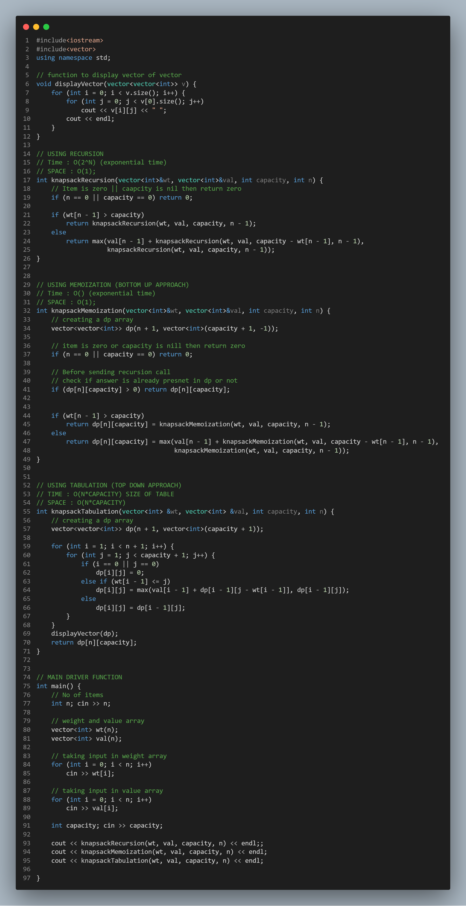

# 0-1 Knapsack:-
---
```c++
#include<iostream>
#include<vector>
using namespace std;

// function to display vector of vector
void displayVector(vector<vector<int>> v) {
    for (int i = 0; i < v.size(); i++) {
        for (int j = 0; j < v[0].size(); j++)
            cout << v[i][j] << " ";
        cout << endl;
    }
}

// 0=1 Knapsack functoin
int knapsack01(vector<int>&value, vector<int>&weight, int capacity) {
    // creating a dp array
    vector<vector<int>> dp(value.size() + 1, vector<int>(capacity + 1, 0));

    // initially first cell of the dp initialized with zero
    dp[0][0] = 0;

    // Now run a loop
    for (int i = 1; i < value.size() + 1; i++) {
        for (int j = 1; j < capacity + 1; j++) {
            // When i bat
            if (j >= weight[i - 1]) {
                int remCap = j - weight[i - 1];

                if (dp[i - 1][remCap] + value[i - 1] > dp[i - 1][j - 1])
                    dp[i][j] = dp[i - 1][remCap] + value[i - 1];
                else
                    dp[i][j] = dp[i - 1][j];
            }
            else {
                // when i don't bat
                dp[i][j] = dp[i - 1][j];
            }
        }
    }

    displayVector(dp);

    return dp[value.size()][capacity];
}


// Main driver function
int main() {
    // No of items
    int n; cin >> n;

    // value and weight array
    vector<int>value(n);
    vector<int>weight(n);

    // taking input in value
    for (int i = 0; i < n; i++)
        cin >> value[i];

    // taking input in weight
    for (int i = 0; i < n; i++)
        cin >> weight[i];

    // capacity of the bag
    int capacity; cin >> capacity;

    cout << knapsack01(value, weight, capacity) << endl;
}
```

## Input:-
```
5
15 14 10 45 30
2 5 1 3 4
7
```

## Output:-
```
0 0 0 0 0 0 0 0 
0 0 15 15 15 15 15 15 
0 0 15 15 15 15 15 29 
0 10 10 25 25 25 25 25 
0 10 10 45 55 55 70 70 
0 10 10 45 55 55 70 75 

75 <-(actual answer)
```

---
---
# Code Image:-

<p align="center">

</p>