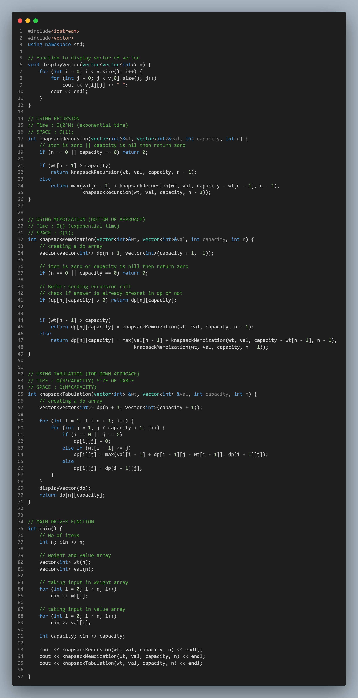

# 0-1 Knapsack:-


<!-- USING RECURSION -->
<details>
<summary>Using Recursion:</summary>
<br>

```c++
// USING RECURSION
// Time : O(2^N) (exponential time)
// SPACE : O(1);
int knapsackRecursion(vector<int>&wt, vector<int>&val, int capacity, int n) {
    // Item is zero || caapcity is nil then return zero
    if (n == 0 || capacity == 0) return 0;

    if (wt[n - 1] > capacity)
        return knapsackRecursion(wt, val, capacity, n - 1);
    else
        return max(val[n - 1] + knapsackRecursion(wt, val, capacity - wt[n - 1], n - 1),
                   knapsackRecursion(wt, val, capacity, n - 1));
}
```
</details>


<details>
<summary>Using Memoization (Bottom-Up Approach):</summary>
<br>

```c++
// USING MEMOIZATION (BOTTOM UP APPROACH)
// Time : O() (exponential time)
// SPACE : O(1);
int knapsackMemoization(vector<int>&wt, vector<int>&val, int capacity, int n) {
    // creating a dp array
    vector<vector<int>> dp(n + 1, vector<int>(capacity + 1, -1));

    // item is zero or capacity is nill then return zero
    if (n == 0 || capacity == 0) return 0;

    // Before sending recursion call
    // check if answer is already presnet in dp or not
    if (dp[n][capacity] > 0) return dp[n][capacity];


    if (wt[n - 1] > capacity)
        return dp[n][capacity] = knapsackMemoization(wt, val, capacity, n - 1);
    else
        return dp[n][capacity] = max(val[n - 1] + knapsackMemoization(wt, val, capacity - wt[n - 1], n - 1),
                                     knapsackMemoization(wt, val, capacity, n - 1));
}
```
</details>


<details>
<summary>Using Tabulation (Top-Down Approach):</summary>
<br>

```c++
// USING TABULATION (TOP DOWN APPROACH)
// TIME : O(N*CAPACITY) SIZE OF TABLE
// SPACE : O(N*CAPACITY)
int knapsackTabulation(vector<int> &wt, vector<int> &val, int capacity, int n) {
    // creating a dp array
    vector<vector<int>> dp(n + 1, vector<int>(capacity + 1));

    for (int i = 1; i < n + 1; i++) {
        for (int j = 1; j < capacity + 1; j++) {
            if (i == 0 || j == 0)
                dp[i][j] = 0;
            else if (wt[i - 1] <= j)
                dp[i][j] = max(val[i - 1] + dp[i - 1][j - wt[i - 1]], dp[i - 1][j]);
            else
                dp[i][j] = dp[i - 1][j];
        }
    }
    displayVector(dp);
    return dp[n][capacity];
}
```
</details>


<!-- FULL SOURCE CODE -->
<details open="true">
<summary>Full Source Code:</summary>
<br>

```c++
#include<iostream>
#include<vector>
using namespace std;

// function to display vector of vector
void displayVector(vector<vector<int>> v) {
    for (int i = 0; i < v.size(); i++) {
        for (int j = 0; j < v[0].size(); j++)
            cout << v[i][j] << " ";
        cout << endl;
    }
}

// USING RECURSION
// Time : O(2^N) (exponential time)
// SPACE : O(1);
int knapsackRecursion(vector<int>&wt, vector<int>&val, int capacity, int n) {
    // Item is zero || caapcity is nil then return zero
    if (n == 0 || capacity == 0) return 0;

    if (wt[n - 1] > capacity)
        return knapsackRecursion(wt, val, capacity, n - 1);
    else
        return max(val[n - 1] + knapsackRecursion(wt, val, capacity - wt[n - 1], n - 1),
                   knapsackRecursion(wt, val, capacity, n - 1));
}


// USING MEMOIZATION (BOTTOM UP APPROACH)
// Time : O() (exponential time)
// SPACE : O(1);
int knapsackMemoization(vector<int>&wt, vector<int>&val, int capacity, int n) {
    // creating a dp array
    vector<vector<int>> dp(n + 1, vector<int>(capacity + 1, -1));

    // item is zero or capacity is nill then return zero
    if (n == 0 || capacity == 0) return 0;

    // Before sending recursion call
    // check if answer is already presnet in dp or not
    if (dp[n][capacity] > 0) return dp[n][capacity];


    if (wt[n - 1] > capacity)
        return dp[n][capacity] = knapsackMemoization(wt, val, capacity, n - 1);
    else
        return dp[n][capacity] = max(val[n - 1] + knapsackMemoization(wt, val, capacity - wt[n - 1], n - 1),
                                     knapsackMemoization(wt, val, capacity, n - 1));
}


// USING TABULATION (TOP DOWN APPROACH)
// TIME : O(N*CAPACITY) SIZE OF TABLE
// SPACE : O(N*CAPACITY)
int knapsackTabulation(vector<int> &wt, vector<int> &val, int capacity, int n) {
    // creating a dp array
    vector<vector<int>> dp(n + 1, vector<int>(capacity + 1));

    for (int i = 1; i < n + 1; i++) {
        for (int j = 1; j < capacity + 1; j++) {
            if (i == 0 || j == 0)
                dp[i][j] = 0;
            else if (wt[i - 1] <= j)
                dp[i][j] = max(val[i - 1] + dp[i - 1][j - wt[i - 1]], dp[i - 1][j]);
            else
                dp[i][j] = dp[i - 1][j];
        }
    }
    displayVector(dp);
    return dp[n][capacity];
}


// MAIN DRIVER FUNCTION
int main() {
    // No of items
    int n; cin >> n;

    // weight and value array
    vector<int> wt(n);
    vector<int> val(n);

    // taking input in weight array
    for (int i = 0; i < n; i++)
        cin >> wt[i];

    // taking input in value array
    for (int i = 0; i < n; i++)
        cin >> val[i];

    int capacity; cin >> capacity;

    cout << knapsackRecursion(wt, val, capacity, n) << endl;;
    cout << knapsackMemoization(wt, val, capacity, n) << endl;
    cout << knapsackTabulation(wt, val, capacity, n) << endl;

}
```
</details>


## Input:-
```
5
2 5 1 3 4
15 14 10 45 30
7
```

## Output:-
```
0 0 0 0 0 0 0 0 
0 0 15 15 15 15 15 15 
0 0 15 15 15 15 15 29 
0 10 10 25 25 25 25 25 
0 10 10 45 55 55 70 70 
0 10 10 45 55 55 70 75 

75 <-(actual answer)
```

---
---


<details>
<summary> Code Image:</summary>
<br>
<p align="center">

</p>
</details>

