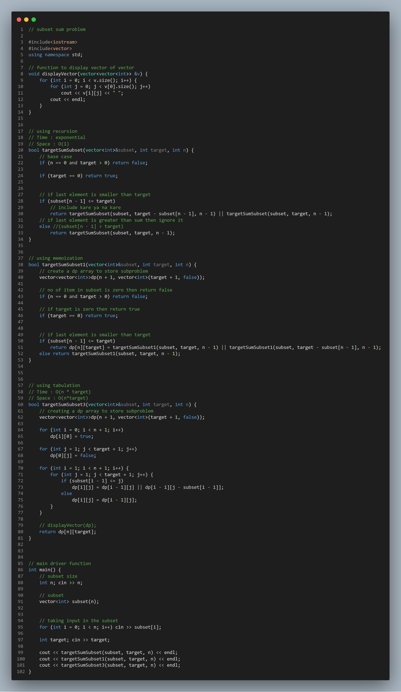

# Target Sum Subset:-

<!-- USING RECURSION -->
<details>
<summary>Using Recursion:</summary>
<br>

```c++
// using recursion
// Time : exponential
// Space : O(1)
bool targetSumSubset(vector<int>&subset, int target, int n) {
    // base case
    if (n == 0 and target > 0) return false;

    if (target == 0) return true;


    // if last element is smaller than target
    if (subset[n - 1] <= target)
        // include kare ya na kare
        return targetSumSubset(subset, target - subset[n - 1], n - 1) || targetSumSubset(subset, target, n - 1);
    // if last element is greater than sum then ignore it
    else //(subset[n - 1] > target)
        return targetSumSubset(subset, target, n - 1);
}
```
</details>


<details>
<summary>Using Memoization (Bottom-Up Approach):</summary>
<br>

```c++
// using memoization
// Time : O(n * target)
// Space : O(n*target)
bool targetSumSubset1(vector<int>&subset, int target, int n) {
    // create a dp array to store subproblem
    vector<vector<int>>dp(n + 1, vector<int>(target + 1, false));

    // no of item in subset is zero then return false
    if (n == 0 and target > 0) return false;

    // if target is zero then return true
    if (target == 0) return true;


    // if last element is smaller than target
    if (subset[n - 1] <= target)
        return dp[n][target] = targetSumSubset1(subset, target, n - 1) || targetSumSubset1(subset, target - subset[n - 1], n - 1);
    else return targetSumSubset1(subset, target, n - 1);
}
```
</details>


<details>
<summary>Using Tabulation (Top-Down Approach):</summary>
<br>

```c++
// using tabulation
// Time : O(n * target)
// Space : O(n*target)
bool targetSumSubset3(vector<int>&subset, int target, int n) {
    // creating a dp array to store subproblem
    vector<vector<int>>dp(n + 1, vector<int>(target + 1, false));

    for (int i = 0; i < n + 1; i++)
        dp[i][0] = true;

    for (int j = 1; j < target + 1; j++)
        dp[0][j] = false;

    for (int i = 1; i < n + 1; i++) {
        for (int j = 1; j < target + 1; j++) {
            if (subset[i - 1] <= j)
                dp[i][j] = dp[i - 1][j] || dp[i - 1][j - subset[i - 1]];
            else
                dp[i][j] = dp[i - 1][j];
        }
    }

    // displayVector(dp);
    return dp[n][target];
}
```
</details>


<!-- FULL SOURCE CODE -->
<details open="true">
<summary>Full Source Code:</summary>
<br>

```c++
// subset sum problem

#include<iostream>
#include<vector>
using namespace std;

// function to display vector of vector
void displayVector(vector<vector<int>> &v) {
    for (int i = 0; i < v.size(); i++) {
        for (int j = 0; j < v[0].size(); j++)
            cout << v[i][j] << " ";
        cout << endl;
    }
}


// using recursion
// Time : exponential
// Space : O(1)
bool targetSumSubset(vector<int>&subset, int target, int n) {
    // base case
    if (n == 0 and target > 0) return false;

    if (target == 0) return true;


    // if last element is smaller than target
    if (subset[n - 1] <= target)
        // include kare ya na kare
        return targetSumSubset(subset, target - subset[n - 1], n - 1) || targetSumSubset(subset, target, n - 1);
    // if last element is greater than sum then ignore it
    else //(subset[n - 1] > target)
        return targetSumSubset(subset, target, n - 1);
}


// using memoization
bool targetSumSubset1(vector<int>&subset, int target, int n) {
    // create a dp array to store subproblem
    vector<vector<int>>dp(n + 1, vector<int>(target + 1, false));

    // no of item in subset is zero then return false
    if (n == 0 and target > 0) return false;

    // if target is zero then return true
    if (target == 0) return true;


    // if last element is smaller than target
    if (subset[n - 1] <= target)
        return dp[n][target] = targetSumSubset1(subset, target, n - 1) || targetSumSubset1(subset, target - subset[n - 1], n - 1);
    else return targetSumSubset1(subset, target, n - 1);
}


// using tabulation
// Time : O(n * target)
// Space : O(n*target)
bool targetSumSubset3(vector<int>&subset, int target, int n) {
    // creating a dp array to store subproblem
    vector<vector<int>>dp(n + 1, vector<int>(target + 1, false));

    for (int i = 0; i < n + 1; i++)
        dp[i][0] = true;

    for (int j = 1; j < target + 1; j++)
        dp[0][j] = false;

    for (int i = 1; i < n + 1; i++) {
        for (int j = 1; j < target + 1; j++) {
            if (subset[i - 1] <= j)
                dp[i][j] = dp[i - 1][j] || dp[i - 1][j - subset[i - 1]];
            else
                dp[i][j] = dp[i - 1][j];
        }
    }

    // displayVector(dp);
    return dp[n][target];
}


// main driver function
int main() {
    // subset size
    int n; cin >> n;

    // subset
    vector<int> subset(n);


    // taking input in the subset
    for (int i = 0; i < n; i++) cin >> subset[i];

    int target; cin >> target;

    cout << targetSumSubset(subset, target, n) << endl;
    cout << targetSumSubset1(subset, target, n) << endl;
    cout << targetSumSubset3(subset, target, n) << endl;
}
```
</details>


## Input:-
```
6
5 1 1 1 0 0
3
```

## Output:-
```
1
1
1

```

---
---


<details>
<summary> Code Image:</summary>
<br>
<p align="center">

</p>
</details>

