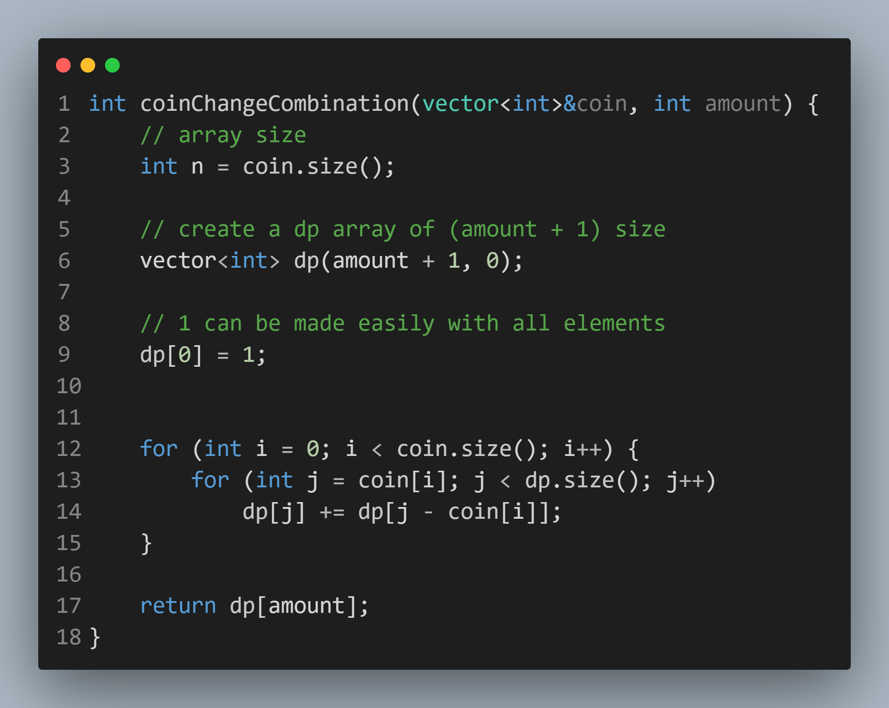

# Coin Change Combination:-
---
```c++
#include<iostream>
#include<vector>
using namespace std;

int coinChangeCombination(vector<int>&coin, int amount) {
	// array size
	int n = coin.size();

	// create a dp array of (amount + 1) size
	vector<int> dp(amount + 1, 0);

	// 1 can be made easily with all elements
	dp[0] = 1;


	for (int i = 0; i < coin.size(); i++) {
		for (int j = coin[i]; j < dp.size(); j++)
			dp[j] += dp[j - coin[i]];
	}

	return dp[amount];
}


// Main driver function
int main() {
	// array size;
	int n; cin >> n;

	// declare a vector
	vector<int> coinArray(n);

	// taking input in the coin array
	for (int i = 0; i < n; i++)
		cin >> coinArray[i];

	// target amount
	int amount; cin >> amount;

	// print the answer
	cout << coinChangeCombination(coinArray, amount) << endl;
}
```

## Input:-
```
3
2 3 5
7
```

## Output:-
```
2
```

---
---
# Code Image:-

<p align="center">

</p>