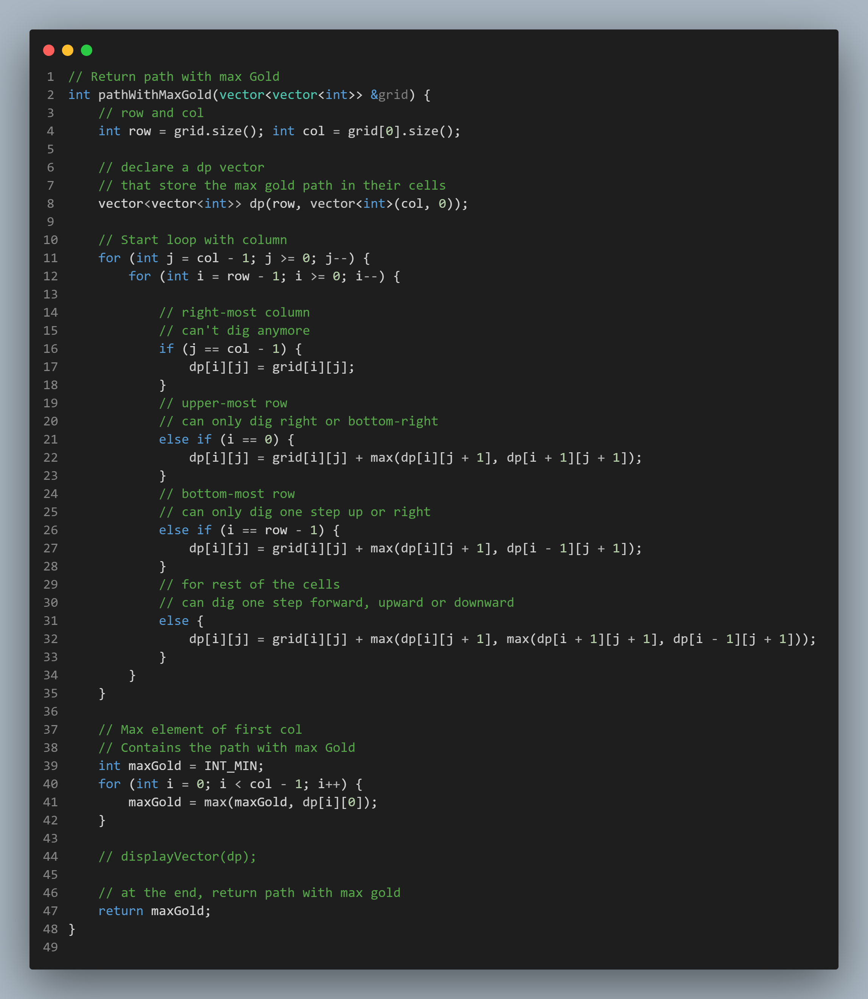

# Path With Max Gold:-
---
```c++
#include<iostream>
#include<vector>
#include<climits>
using namespace std;

// function to display vector of vector
void displayVector(vector<vector<int>> v) {
	for (int i = 0; i < v.size(); i++) {
		for (int j = 0; j < v[0].size(); j++)
			cout << v[i][j] << " ";
		cout << endl;
	}
}


// Return path with max Gold
int pathWithMaxGold(vector<vector<int>> &grid) {
	// row and col
	int row = grid.size(); int col = grid[0].size();

	// declare a dp vector
	// that store the max gold path in their cells
	vector<vector<int>> dp(row, vector<int>(col, 0));

	// Start loop with column
	for (int j = col - 1; j >= 0; j--) {
		for (int i = row - 1; i >= 0; i--) {

			// right-most column
			// can't dig anymore
			if (j == col - 1) {
				dp[i][j] = grid[i][j];
			}
			// upper-most row
			// can only dig right or bottom-right
			else if (i == 0) {
				dp[i][j] = grid[i][j] + max(dp[i][j + 1], dp[i + 1][j + 1]);
			}
			// bottom-most row
			// can only dig one step up or right
			else if (i == row - 1) {
				dp[i][j] = grid[i][j] + max(dp[i][j + 1], dp[i - 1][j + 1]);
			}
			// for rest of the cells
			// can dig one step forward, upward or downward
			else {
				dp[i][j] = grid[i][j] + max(dp[i][j + 1], max(dp[i + 1][j + 1], dp[i - 1][j + 1]));
			}
		}
	}

	// Max element of first col
	// Contains the path with max Gold
	int maxGold = INT_MIN;
	for (int i = 0; i < col - 1; i++) {
		maxGold = max(maxGold, dp[i][0]);
	}

	displayVector(dp);

	// at the end, return path with max gold
	return maxGold;
}


int main() {
	// Row and Col
	int row, col;
	cin >> row >> col;

	// Declare a 2-D vector
	vector<vector<int>> arr(row, vector<int>(col, 0));


	// taking input in the vector
	for (int i = 0; i < row; i++) {
		for (int j = 0; j < col; j++)
			cin >> arr[i][j];
	}


	// printing the path with max gold
	cout << pathWithMaxGold(arr);
}
```

### Input:
```
6 6
0 1 4 2 8 2
4 3 6 5 0 4
1 2 4 1 4 6
2 0 7 3 2 2
3 1 5 9 2 4
2 7 0 8 5 1
```

### Output:
``` 
36 
```

---
---
# Code Photo:-
<p align="center">

</p>
